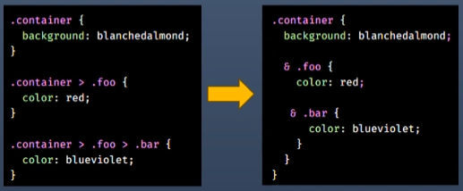
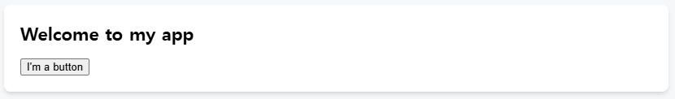
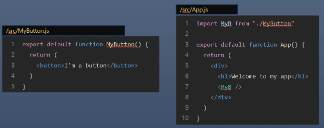
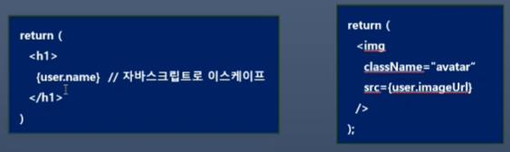
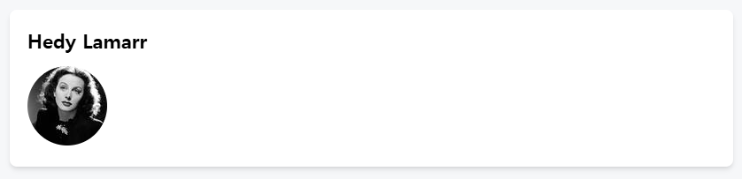
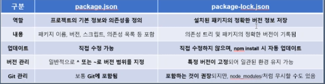
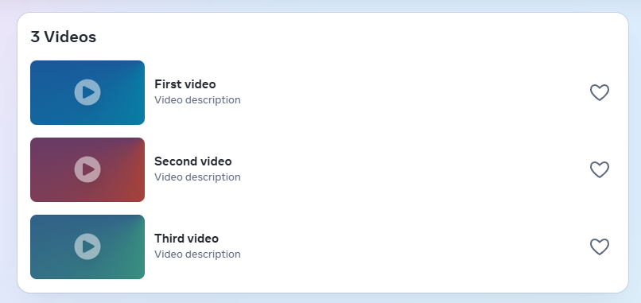
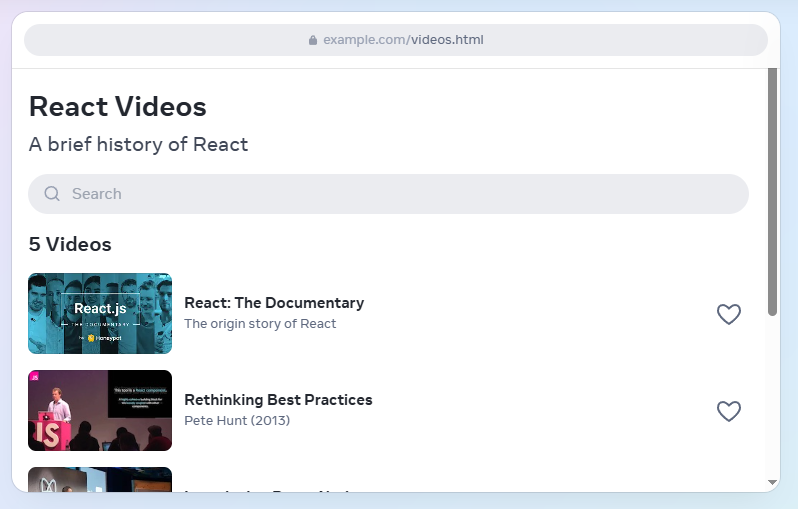
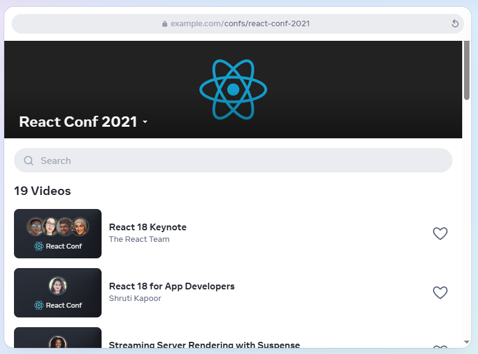
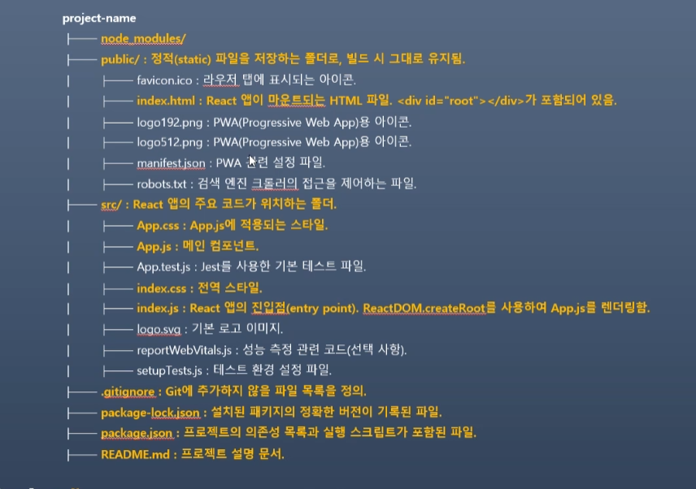

# 202030121 이승엽

## 3월 27일 (4주차)
### Component 생성 및 nesting(중첩)  
* React앱은 component로 만들어짐  
  - component는 고유한 로직과 모양을 가진 UI의 일부  
  - 버튼처럼 작을 수도 있고, 전체 페이지처럼 클 수도 있음  
  - 마크업을 반환하는 자바스크립트 함수 

* Nesting은 CSS 선택자의 중첩 구조와 비슷함  
    
* 예제 App.js  
  ```javascript
      function MyButton() {
        return (
          <button>
            I'm a button
          </button>
        );
  }

    export default function MyApp() {
      return (
        <div>
          <h1>Welcome to my app</h1>
          <MyButton />
        </div>
      );
  }
  ```  
    
* exprot default 선언의 위치  
  - vscode에서 자동완성할 경우 맨 아래에 선언됨  
  - 하지만 공식 문서처럼 main component의 function 키워드 왼쪽에 선언하는 것을 권장  
  - exprot default 키워드는 파일내의 component중 기본 component를 지정  

* export default와 export의 차이  
  - Named Exports (export)  
    - 하나의 파일안에 여러 개의 component가 있을 때 사용  
    - component를 사용하는 쪽에서는 component의 정확한 이름을 반드시 명시  
    - ex) import {add, subtract, mulutiply, divide} from './math'  
  - Default Exports (export default)  
    - 하나의 파일안에서 하나의 component만 내보내는 경우 사용  
    - component를 사용하는 쪽에서 어떤 이름을 사용해도 상관 없음  
    - ex) import calc from './calculator'  
* MyButton component 분리 예제  
    
### JSX로 마크업 작성하기  
* 앞에서 작성한 코드의 마크업 문법을 JSX라고 함  
* React 프로젝트에서는 편의성을 위해 JSX를 사용  
* JSX는 HTML보다 더욱 엄격한 문법을 적용  
* JSX에서는 싱글 태그라도 태그를 닫아야함  
* React에서는 여러 개의 component를 JSX 태그로 반환할 수 있음  
* 예제 AboutPage.js  
  ```javascript
    function AboutPage() {
    return (
      <>
        <h1>About</h1>
        <p>Hello there.<br />How do you do?</p>
      </>
    );
  }
  ```   
### 스타일 추가하기  
* React에서는 className으로 CSS 클래스를 지정  
  ``````  

* className은 html의 class 속성과 동일한 방식으로 동작  
* CSS 규칙은 별도의 CSS 파일에 작성. 그런데 React는 CSS 파일을 추가하는 방법을 규정하지 않음  
  - 정적 페이지를 작성할 때와 동일한 방법을 지원  
  ```javascript
  /* in your CSS */
  .avatar {
    border-radius: 50%;
  }
  ```  
* 가장 간단한 방법은 html에 ``<link>`` 태그를 추가  
  - link를 추가하면 정적페이지를 수정해야 하기 때문에 추천하지 않음  

### 데이터 표시  
* JSX를 사용하면 자바스크립트에 마크업을 넣을 수 있음  

* JSX 코드 내에서 자바스크립트로 탈출하여 표현식을 사용하는 것  
  - 이 방법을 Escape Back 이라고 함  
* {} 중괄호를 사용하여 변수나 표현식을 사용자에게 표시  
  
  - src 속성에 user.imageUrl 변수의 값을 전달하여 이미지의 경로를 설정  
* 예제 Profile.js  
  ```javascript
      const user = {
    name: 'Hedy Lamarr',
    imageUrl: 'https://i.imgur.com/yXOvdOSs.jpg',
    imageSize: 90,
  };

  export default function Profile() {
    return (
      <>
        <h1>{user.name}</h1>
        
      </>
    );
  }
  ```  
  

## 3월 20일 (3주차)
### 의존성 관리와 package.json  
* packge.json  
  - 패키지의 의존성을 관리하는 파일  
  - 의존성이란, 하나의 소프트웨어가 다른 소프트웨어(라이브러리, 패키지, 모듈 등)에 의존하여 동작하는 관계  
  - 각종 패키지 등의 버전을 동일하게 유지하기 위한 것  

* 의존성 관리  
  - 협업을 할 때는 팀원들 각자의 컴퓨터에 같은 패키지들을 설치하여 동일한 개발환경 구축  
  - node 패키지는 각 팀원들이 설치  
  - 의존성을 무시할 시 개발 프로젝트 오류 등이 발생  

* package.json의 의존성 내용 종류  
  - dependencies : 실제 코드에서 사용하는 라이브러리  
  - devDependencies : 개발할 때만 필요한 라이브러리들  
  - peerDependencies : 필요한 라이브러리만, 직접 설치하지 않고 사용자에게 설치를 맡기는 경우  
  - optionalDpendencies : 선택적 의존성

* package.json과 package-lock.json의 차이  
  
  - package-lock.json에는 정확한 버전이 기록되어 있고, npm install을 실행해도 같은 버전이 설치됨  
  - 따라서, 팀 프로젝트에서는 package-lock.json을 유지하는 것이 중요  
  
* package.json을 유지해야하는 이유  
  - 프로젝트의 의존성 정보 제공  
    - 프로젝트에서 어떤 패키지를 사용하는지 정의하는 역할  
    - 어떤 패키지를 설치해야 하는지 알 수 있는 기준이 됨  
  - 버전 범위 설정 가능  
    - 최신 패치 버전을 허용할 수도 있고, 정확한 버전만 고정 가능  
    - 개발자가 원하는 방식으로 유연하게 관리  
  - 스크립트와 메타데이터 저장  
    - "scripts" 속성을 이용해 빌드, 테스트, 실행 등의 명령어 저장  
    - 프로젝트 실행을 위해서는 필수  
  - 새로운 패키지 설치 및 관리  
    - 패키지를 설치하면 package.json에 추가, package-lock.json에 정확한 버전이 기록  

### node module의 재설치  
* node module을 다시 설치해야 하는 경우
  - 팀 작업을 하면서 깃허브로부터 프로젝트 파일을 clone 했을 경우  
  - 개인이 자신의 프로젝트를 다른 PC 등에서 clone을 받아 계속 개발해야 하는 경우  
  - 프로젝트에 문제가 생겨서 node module을 다시 설치해야하는 경우  

* clone을 받은 프로젝트의 경우  
  - 다음 명령을 실행하면 패키지를 다시 설치  
     ```
    npm install
    ```  
  - node_modules 디렉토리는 자동 생성  
  - 설치가 끝나면 프로젝트 동작 확인  

* 프로젝트에 오류나 의존성 등의 문제가 생겼을 경우  
  - node_modules 폴더와 package-lock.json 파일 삭제  
    ```
    rm -rf node_modules package-lock.json
    ```  
  - npm 패키지의 임시 저장소인 cache를 초기화  
    - force 옵션 강제 삭제  
    ```
    npm cache clean --force
    ```  
    
  - 패키지 재설치  
    ```
    npm install
    ```  

* package-lock.json을 삭제하는 이유  
  - package-lock.json이 손상 혹은 잘못된 의존성이 있을 때  
    - package-lock.json을 삭제 후 새로 생성하면 해결될 수 있음  
  - 최신 버전의 패키지를 다시 받고 싶을 때  
    - 재설치 권장  
  - 팀 프로젝트에서 다른 팀원이 이상한 상태로 package-lock.json 업데이트 시  
    - 재설치 권장  

### React
* React는 component 단위로 개발하여 조립하듯이 앱을 완성  
* component는 작은 기능을 실행할 수 있는 하나의 모듈  
  - 공식 사이트의 홈에 component 사용법 기재  

### Component를 사용한 유저 인터페이스 생성  
* 사용자 인터페이스 구축  
  - Video, Thumbnail 및 LikeButton이라는 react component 생성, 이 component를 결합하여 화면과 페이지 그리고 앱 전체를 구성  
  - 예제 Video.js
      ```javascript
      function Video({ video }) {
        return (
          <div>
            <Thumbnail video={video} />
            <a href={video.url}>
              <h3>{video.title}</h3>
              <p>{video.description}</p>
            </a>
            <LikeButton video={video} />
          </div>
        );
      }
      ```
      

### Component를 작성하는 JavaScript와 Markup  
* React Component는 JavaScript 함수
  - 조건에 따라 화면을 다르게 표시하고 싶다면 if문 사용  
  - 목록을 표시하고 싶다면 map()함수 이용  
  - 예제 VideoList.js  
    ```javascript
      function VideoList({ videos, emptyHeading }) {
        const count = videos.length;
        let heading = emptyHeading;
        if (count > 0) {
          const noun = count > 1 ? 'Videos' : 'Video';
          heading = count + ' ' + noun;
        }
        return (
          <section>
            <h2>{heading}</h2>
            {videos.map(video =>
              <Video key={video.id} video={video} />
            )}
          </section>
        );
    }
    ```
      
    - 이 마크업 구문을 JSX라고 부름. React에 의해서 대중화된 자바스크립트 구문의 확장

### 필요한 곳에 상호작용 요소 추가  
* React Component는 데이터를 수신하고, 화면에 표시해야 하는 내용을 반환  
  - 사용자의 입력을 받아 새로운 데이터를 component에 전달할 수 있음  
  - 이때 React는 상호작용을 통해 얻은 새 데이터로 화면을 업데이트  
  - 예제 SearchableVideoList.js  
    ```javascript
    import { useState } from 'react';
    function SearchableVideoList({ videos }) {
      const [searchText, setSearchText] = useState('');
      const foundVideos = filterVideos(videos, searchText);
      return (
        <>
          <SearchInput
            value={searchText}
            onChange={newText => setSearchText(newText)} />
          <VideoList
            videos={foundVideos}
            emptyHeading={`No matches for “${searchText}”`} />
        </>
      );
    }
    ```
      
    - React를 기존 HTML 페이지에 추가하고, 페이지 어디에서나 상호작용하는 React Component를 렌더링할 수 있음

### Full-stack App 개발을 도와주는 React Framework
* React는 라이브러리이기 때문에 component를 조립할 수 있지만, 라우팅 및 데이터 가져오기 방법 등을 규정하진 않음  
* React로 전체 앱을 빌드하려면 Next.js 또는 Remix와 같은 풀스택 리액트 프레임워크를 사용  
* 사이트의 confs/[slug].js는 Next.js에서 제공하는 라우팅 방법 중 하나  
  - 예제 confs/[slug].js  
    ```javascript
    import { db } from './database.js';
    import { Suspense } from 'react';

    async function ConferencePage({ slug }) {
      const conf = await db.Confs.find({ slug });
      return (
        <ConferenceLayout conf={conf}>
          <Suspense fallback={<TalksLoading />}>
            <Talks confId={conf.id} />
          </Suspense>
        </ConferenceLayout>
      );
    }

    async function Talks({ confId }) {
      const talks = await db.Talks.findAll({ confId });
      const videos = talks.map(talk => talk.video);
      return <SearchableVideoList videos={videos} />;
    }
    ```
      
    - React는 아키텍처이기도 함. 이를 구현하는 프레임워크는 서버에서 실행되는 비동기 컴포넌트 혹은 빌드 중에 실행되는 비동기 컴포넌트에서 데이터를 가져올 수 있도록 함.  
    - 파일이나 데이터베이스에서 데이터를 읽고, 이를 상호작용하는 컴포넌트에 전달할 수 있음  

### 네이티브 UX 실현  
* React Native와 Expo를 사용하면 안드로이드, iOS 등을 위한 앱을 React로 빌드 가능  
* 플랫폼에서 제공하는 안드로이드 및 iOS View를 사용하면 UI를 네이티브로 구현 가능  
* 기업에서는 플랫폼 간의 장벽을 허물고, 전체 기능을 협업을 통해 개발할 수 있는 팀을 구성할 수 있음  


## 3월 13일 (2주차)
### Node.js
* 장점
  - 비동기 논 블로킹 I/O로 높은 성능 제공
  - 풀스택 개발 가능으로 생산성 향상
  - NPM의 방대한 생태계 활용 가능
  - 경량 서버 개발에 적합
  - 실시간 데이터 처리가 강력함   
* 단점  
  - CPU 집약적인 작업에 부적합 : 싱글 스레드 기반
  - 보안에 취약함

### React Project 생성  
```
npx create-react-app 이름
cd 이름
npm start
```

### React Project 구조 및 역할

* node_modules  
  - 초기 node module 및 새로 설치하는 패키지가 저장됨  
  - git으로 관리하지 않기 때문에 디렉토리 이름이 흐릿하게 나옴  

* public  
  - 정적(static) 파일을 저장하는 디렉토리  
  - build 후 배포할 html, css, js 등이 보관되는 곳  

* src/  
  - React 프로젝트의 주요 코드가 위치하는 디렉토리  
  - 개발하면서 대부분의 작업이 이루어지는 곳  

* src/App.js  
  - 메인 component  
  - 출력을 위해 index.js로 전달됨  

* src/App.css  
  - App.js에 적용되는 스타일을 정의하는 스타일 파일  

* src/index.js  
  - React 앱의 진입 점으로 최종 렌더링이 되는 곳  
  - ReactDOM.createRoot를 사용하여 App.js를 렌더링  

* src/index.css  
  - 전역 스타일을 정의하는 스타일 파일  


