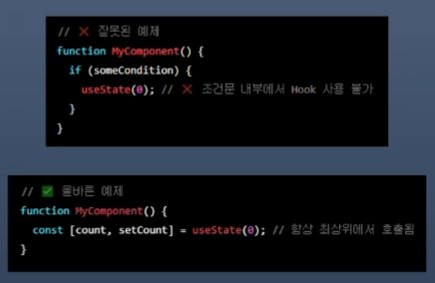

# 202030121 이승엽

## 5월 8일 (9주차)
### React로 사고하기  
* React로 사용자 인터페이스를 빌드할 때, 먼저 이를 컴포넌트 조각으로 나눔.  
* 각 컴포넌트의 다양한 시각적 상태들을 정의  
* 컴포넌트들을 연결하여 데이터가 그 사이를 흘러가게 함.  

### 모의 시안과 함께 시작  
* JSON API는 아래와 같은 형태의 데이터를 반환  
```javascript
  [
    { category: "Fruits", price: "$1", stocked: true, name: "Apple" },
    { category: "Fruits", price: "$1", stocked: true, name: "Dragonfruit" },
    { category: "Fruits", price: "$2", stocked: false, name: "Passionfruit" },
    { category: "Vegetables", price: "$2", stocked: true, name: "Spinach" },
    { category: "Vegetables", price: "$4", stocked: false, name: "Pumpkin" },
    { category: "Vegetables", price: "$1", stocked: true, name: "Peas" }
  ]
```   
### Step 1 : UI를 컴포넌트 계층으로 쪼개기  
* Programming : 새로운 함수나 객체를 만드는 방식과 같은 방법으로 한다  
  - 이 중 단일책임 원칙을 반영하고자 한다면 컴포넌트는 이상적으로는 한 번에 한 가지 일만 해야 한다  
  - 만약 컴포넌트가 점점 커진다면 작은 하위 컴포넌트로 쪼개야 함  

* CSS : 클래스 선택자를 무엇으로 만들지 생각한다
* Design : 디자인 계층을 어떤 식으로 구성할 지 생각한다
* JSON이 잘 구조화 되었다면, UI의 컴포는트 구조가 자연스럽게 데이터 모델에 대응  
* 이는 UI와 데이터 모델은 보통 같은 정보 아키텍처, 즉 같은 구조를 가지기 때문  
* UII를 컴포넌트로 분리하고, 각 컴포넌트가 데이터 모델에 매칭될 수 있도록 하기  
* 다섯개의 컴포넌트  
  - FilterableProductTable(회색): 예시 전체를 포괄  
  - SearchBar(파란색): 사용자의 입력을 받는다  
  - ProductTable(보라색): 데이터 리스트를 보여주고, 사용자의 입력을 기반으로 필터링  
  - ProductCategoryRow(초록색): 각 카테고리의 헤더  
  - ProductRow(노란색): 각각의 제품에 해당하는 행  
    

* ProductTable을 보면 Name과 Price 레이블을 포함한 테이블 헤더 기능만을 가진 컴포넌트는 없음  
  - 독립된 컴포넌트를 따로 생성할 지 안할지는 선택  
* 계층 구조로 정리하면  
    
  - 한 컴포넌트 내에 있는 다른 컴포넌트는 계층 구조에서 자식으로 표현  

### Step 2 : React로 정적인 버전 구현하기  
* 가장 쉬운 접근 방법은 상호작용 기능은 아직 추가하지 않고, 데이터 모델로부터 UI를 렌더링하는 버전을 만드는 것  
  - 대체로 먼저 정적인 버전을 만들고 상호작용 기능을 추가하는게 더 쉬움  
  - 정적 버전을 만드는 것은 많은 타이핑이 필요하지만, 생각할 것은 더 적음  
  - 반대로 상호작용 기능을 추가하는 것은 많은 생각이 필요하지만, 타이핑은 그리 필요치 않음  

* 데이터 모델을 렌더링하는 앱의 정적인 버전을 만들기 위해서는  
  - 다른 컴포넌트를 재사용하고, props를 이용하여 데이터를 넘겨주는 컴포넌트를 구현  
* props는 부모가 자식에게 데이터를 넘겨줄 떄 사용할 수 있는 방법  
* 정적인 버전을 만들 때는 state 쓰면 안됨  
  - state는 오직 상호작용을 위해, 즉 시간이 지남에 따라 데이터가 바뀌는 것에 사용  
* 앱을 만들 때 계층 구조에 따라 상층부에 있는 컴포넌트 즉, 1. FilterableProductTable부터 시작하는 하양식(top-down)으로 만드는 방법이 있음  
  - 또는 하층부에 있는 컴포넌트인 5. ProductRow부터 상향식(bottom-up)으로 만들 수 있음  
  - 보통 하향식으로 만드는게 더 쉽지만, 프로젝트가 커지면 상향식으로 만들고 테스트를 작성하면서 개발하기가 더 쉬움  
* 이 단계가 끝나면 데이터 렌더링을 위해 만들어진 재사용 가능한 컴포넌트들의 라이브러리를 가지게 됨  
* 현재는 앱의 정적 버전이기 때문에 컴포넌트는 단순히 JSX만 리턴함  
* 계층구조의 최상위 component(FilterableProductTable)는 prop으로 데이터 모델을 받음  
* 이는 데이터가 최상위 컴포넌트부터 트리의 아래까지 흘러가기 때문에 단방향 데이터 흐름이라고 부름  

### step2에 있는 컴포넌트 구현  


## 4월 18일 (8주차)  
### 한 번 더 state 끌어올리기  
* 플레이 기록을 추적하기 위해 Game 컴포넌트에 몇 개의 state를 추가  

  ```javascript
  export default function Game() {
    const [xIsNext, setXIsNext] = useState(true);
    const[history, setHistory] = useState([Array(9),fill(null)]);
  }
  ```  
* 현재 플레이에 대한 square를 렌더링하려면 history에서 마지막 squares의 배열을 읽어야 함  
  - 렌더링 중에 계산할 수 있는 충분한 정보가 이미 있으므로 useState는 필요치 않음  
  ```javascript
  const currentSquare = history[history.length - 1];
  ```  
* Board 컴포넌트가 props에 의해 완전히 제어되도록 수정  
  - Board 컴포넌트가 xIsNext, square, onPlay 함수를 props로 받을 수 있도록 변경  
   - onPlay는 Board가 업데이트된 square를 배열로 호출할 수 있는 새로운 함수  
  - 다음으로 Board 함수에서 useState를 호출하는 처음 두 줄을 제거  
  ```javascript
  const [xIsNext, setXIsNext] = useState(true);
  const [square, setSquare] = useState(Array(9).fill(null));
  ```  
  - Board 컴포넌트의 handleClick에 있는 setSquares 및 setXIsNext 호출을 새로운 onPlay 함수에 대한 단일 호출로 대체함으로써 사용자가 사각형을 클릭할 때 Game 컴포넌트가 Board를 업데이트 할 수 있음  
* Board 컴포넌트는 Game 컴포넌트가 전달한 props에 의해 완전히 제어  
* 게임이 다시 작동하게 하려면 Game 컴포넌트에서 handlePlay 함수를 구현  
* 앞에서 `setHistory([...history, nextSquare]);`는 history에 있는 모든 항목을 포함하는 새 배열을 만들고 그 뒤에 nextSquares를 만듦  

### 화면이 한 줄로 깨져서 보이는 이유  
* Square 컴포넌트에서 <button>을 <div>로 감싸서 생기는 문제  
  - <></>로 감싸거나 <button>만 남기기  

### 과거 움직임 보여주기  
* 게임의 히스토리를 기록하기 때문에, 플레이어에게 과거 플레이 목록을 보여줄 수 있음  
  - <button>과 같은 React 엘리먼트는 일반 JavaScript 객체이므로 애플리케이션에서 전달할 수 있음  
  - React에서 여러 엘리먼트를 렌더링하려면 React 엘리먼트 배열을 사용할 수 있음  
  - 이미 state에 이동 history 배열이 있기 때문에 이것을 React 엘리먼트 배열로 변환  
  - JavaScript에서 한 배열을 다른 배열로 변환하려면 배열 map 메서드를 사용  
  `[1, 2, 3].map((x) => x * 2) // [2, 4, 6]`  

### map함수의 사용  
* map의 기본 구문은 map(callbackFn, thisArg)  

* thisArg는 내부에서 this로 사용할 값을 지정하는데 화살표 함수에서는 생략  
* 화살표 함수가 callback함수를 대신함, squares, move는 화살표 함수의 매개변수  
* history.map: history는 모든 플레이를 저장하는 배열. 이 history에 map함수를 작용한다는 의미  
* map함수는 history 각각의 요소 index를 순회하면서 squares를 추출  
* 각 요소는 {}안의 실행문을 실행하면서 버튼을 생성  
  - 이렇게 생성된 버튼은 moves 객체(배열)에 다시 저장  
  * move는 최종 렌더링에 사용  
* 정리하면  
  - 원본 배열 (history) : map이 호출된 원본 배열  
  - 원본 배열의 인덱스 (move) : 현재 순환 중인 원본 배열 요소의 인덱스  
  - 요소 값 (squares) : 현재 순회 중인 요소 배열의 값  
    
* 각각의 history 요소에 대한 {}의 실행문(후작업) 실행  
* moves 객체에 저장  
* 최종 출력에 사용  

### Key 선택하기  
* 리스트를 렌더링할 때 React는 렌더링 된 각 리스트 항목에 대한 몇 가지 정보를 저장  

* 리스트를 업데이트할 때 React는 무엇이 변경되었는지 확인해야 함  
* 리스트의 항목은 추가, 제거, 또는 업데이트  
* 만약 데이터베이스에서 데이터를 불러와서 사용한다면 Alexa, Ben, Claudia의 데이터베이스 ID를 key로 사용 가능  
```javascript
  <li key={user.id}>
    {user.name}: {user.taskCount} tasks left
  </li>
```  
* 리스트가 다시 렌더링 되면 React는 각 리스트 항목의 key를 가져와서 이전 리스트의 항목에서 일치하는 key 탐색  
  - 현재 리스트에서 이전에 존재하지 않았던 ket가 있다면 React는 컴포넌트를 생성  
  - 현재 리스트에서 이전 리스트에 존재했던 key를 가지고 있지 않다면 React는 그 key를 가진 컴포넌트를 제거  
  - 두 key가 일치한다면 해당 컴포넌트는 이동   
  - key는 각 React가 각 컴포넌트를 구별할 수 있도록 하여, 컴포넌트가 다시 렌더링 될 때 React가 해당 컴포넌트의 state를 유치할 수 있게 함  
  - 컴포넌트의 key가 변하면 컴포넌트는 제거되고 새로운 state와 함께 다시 생성  
* key는 React에서 특별하게 미리 지정된 프로퍼티  
* 엘리먼트가 생성되면 React는 key 프로퍼티를 추출하여 반환되는 엘리먼트에 직접 key를 저장  
* key가 props로 전달되는 것 처럼 보일 수 있지만, React는 자동으로 key를 사용해 업데이트할 컴포넌트를 결정  
* 부모가 지정한 key가 무엇인지 컴포넌트는 알 수 없음  
* key가 지정되지 않은 경우, React는 경고를 표시하며 배열의 인덱스를 기본 key로 사용  
* 배열 인덱스를 key로 사용하면 리스트 항목의 순서를 바꾸거나 항목을 추가/제거할 때 문제가 발생  
* 명시적으로 key={i}를 전달하면 경고는 사라지지만 배열의 인덱스를 사용할 때와 같은 문제가 발생하므로 대부분 비추천  
* key는 전역적으로 고유할 필요는 없으며, 컴포넌트와 해당 컴포넌트의 형제 컴포넌트 사이에서만 고유하면 됨  

### 시간여행 구현하기 - 1
* 틱택토 게임의 기록에서 과거의 각 플레이에는 플레이의 일련번호인 고유 ID가 존재  
* 플레이 인덱스를 key로 사용하는 것이 안전  
  - Game 함수에서 <li key={move}>로 key를 추가할 수 있으며, 렌더링 된 게임을 다시 로드하면 React의 key 에러가 사라짐  
  ```javascript
  const moves = history.map((square, move) = > {
    //...
    return (
      <li key={move}>
        <button onClick={() => jumpTo(move)}>{description}</button>
      </li>
    );
  });
  ```  

### 시간여행 구현하기 - 2  
* jumpTo를 구현하기 전에 사용자가 현재 어떤 단계를 보고 있는지를 추적할 수 있는 Game 컴포넌트의 state가 하나 더 필요함  
  - 이를 위해 초기값이 0인 currentMove라는 새 state 변수를 정의  
  ``` const [currentMove, setCurrnetMove] = useState(0); ```  
  - 다음으로 Game 내부의 jumpTo 함수를 수정해서, 해당 currnetMove를 업데이트  
  - 또한, currnetMove를 변경하는 숫자가 짝수면 xIsNext를 true로 설정  
  ```javascript
    function jumpTo(nextMove) {
      setCurrnetMove(nextMove);
      setXIsNext(nextMove % 2 === 0);
      //...
    }
  ```   
* 시간을 거슬러 올라가는 시점에서 새로운 플레이를 하는 경우 해당 시점까지의 히스토리만 유지  
  - history의 모든 항목(... 전개 구문) 뒤에 nextSquares를 추가하는 대신 history.slice(0, currnetMove + 1)의 모든 항목 뒤에 추가하여 이전 히스토리의 해당 부분만 유지  
* 이동할 때마다 최신 히스토리 항목을 가리키도록 cuurrnetMove를 업데이트  
  ```javascript
    function handlePlay(nextSquare) {
    const nextHistory = [...history.slice(0, currntMove + 1), nextSquare];
    setHistory(nextSquare);
    setCurrnetMove(nextHistory.length - 1);
    setXIsNext(!xIsNext);
  }
  ```
  - 내부적으로 동작하지만 렌더링은 안되는 상태  

* 항상 마지막 동작을 렌더링하는 대신 현재 선택한 동작을 렌더링하도록 Game 컴포넌트를 수정  
  - [history.length - 1] -> [currntMove]
    ```javascript
      function handlePlay(nextSquare) {
      const nextHistory = [...history.slice(0, currentMove + 1), nextSquare];
      setHistory(nextHistory);
      setCurrentMove(nextHistory.length - 1);
      setXIsNext(!xIsNext);
    }
    ```

### 최종정리  
* 코드를 자세히 살펴보면 currentMove가 짝수일 대는 xIsNext === true가 되고, currentMove가 홀수일 때는 xIsNext === false가 되는 것을 알 수 있음  

* 즉, currnetMove의 값을 알고 있다면 언제나 xIsNext가 무엇인지 알아낼 수 있음  
* 따라서 이 두 가지 state를 모두 저장할 이유가 없음  
* 항상 중복되는 state 확인  


## 4월 17일 (7주차)
### state 끌어올리기  
```javascript
  export default function Board() {
    //...
    return (
      <>
      <div className="board-row">
        <Square value={squares[0]} onSquareClick={() -> handleClick(0)}/>
        //..
    );
  }
```  
  - handleClick(0) 함수를 화살표 함수가 호출하고, 화살표 함수를 Square에 전달  

* 이제 Board가 모든 state를 관리하므로 부모 Board 컴포넌트는 자식 Square 컴포넌트가 올바르게 표시될 수 있도록 props를 전달  
* Square를 클릭하면 자식 Square 컴포넌트가 부모 Board 컴포넌트에 Board의 state를 업데이트 하도록 요청  
* Board의 state가 변경되면 Board 컴포넌트와 모든 자식 Square 컴포넌트가 자동으로 다시 렌더링  
* Board 컴포넌트에 속한 모든 Square의 state를 유치하면 나중에 승패를 결정할 수 있음  
* 중요한점  
  - DOM <button> 엘리먼트의 onClick 어트리뷰트(속성)는 빌트인 컴포넌트이기 때문에 React에서 특별한 의미를 가짐  
  - 사용자 정의 컴포넌트, dPfmf emfdj Square의 경우 이름은 사용자가 원하는 대로 지을 수 있음  
  - Square의 onSquareClick prop나 Board의 handleClick 함수에 어떠한 이름을 붙여도 코드는 동일하게 작동  
  - React에서는 주로 이벤트를 나타내는 prop에는 onSomething과 같은 이름을 사용하고, 이벤트를 처리하는 함수를 정의 할 때는 handleSomething과 같은 이름을 사용  

### 불변성  
* handleClick에서 기존 배열을 수정하는 대신 slice()를 호출하여 squares배열의 사본 생성하는 이유  
  - 일반적으로 데이터를 변경하는 방법에는 두 가지가 있음  
    - 첫 번째 방법은 데이터의 값을 직접 변경하여 데이터를 변형하는 것  
    - 두 번째 방법은 원하는 변경사항이 있는 새 복사본으로 데이터를 대체  
  - 최종 결과는 같지만 원본 데이터를 직접 변형하지 않음으로써 몇 가지 이점을 얻을 수 있음  
    - 불변성을 사용하면 복잡한 기능을 훨씬 쉽게 구현할 수 있음  
    - 컴포넌트가 데이터의 변경 여부를 저렴한 비용으로 판단할 수 있음  

### 교대로 두기 -1  
* "O" 표시를 보드에 표시하기 위한 코드 작성  
  - 첫 번째 두는 말을 "X"로 설정.  
  - X와 O가 번갈아 한 번씩 두어야 하기 때문에 X가 두었는지 아닌지 현재의 상태를 보관  
  ```javascript
    function Board() {
      const [xIsNext, setXIsNext] = useState(true);
      const [squares, setSquares] = useState(Array(9).fill(null));
      //...
    }
  ```  
* 완성된 코드는 다음과 같다.  
  ```javascript
    export default function Board() {
      const [xIsNext, setXIsNext] = useState(true);
      const [square, setSquare] = useState(Array(9).fill(null));

      function handleClick(i) {
        const nextSquare = square.slice();
        if (xIsNext) {
          nextSquare[i] = "X";
        } else {
          nextSquare[i] = "O";
        }
        setSquare(nextSquare)
        setXIsNext(!xIsNext);
      }
      //...
    }
  ```  

### 교대로 두기 - 2
* 이미 클릭된 자리에 다시 클릭하면 덮어씌우는 문제를 수정  

  - square가 이미 채워져 있는 경우 Board의 state를 업데이트하기 전에 handleClick 함수에서 조기에 return 한다  
  ```javascript
    function handleClick(i) {
      return;
    }
    const nextSquares = squares.slice();
    //...
  ```  
  - 이러면 빈 사각형에만 클릭이 가능해짐  
* return의 의미  
  - 자바스크립트에서 return값이 없는 return;은 함수를 즉시 종료하는 의미  
  - 이때 반환하지 않으면 자동으로 undefined를 반환  
  - squares[i]가 이미 값이 있다면, 그 자리에 다시 둘 수 없으니 아무 일도 하지말고 함수를 끝내는 것.  

### 승자 결정하기  
* 게임의 승즈가 결정되어 더 이상 차례를 만들 필요가 없을 때도 표시해야 함.  
* 이를 위해 9개의 사각형 배열을 가져와서 승자를 확인하고, 적절하게 'X', 'O', 또는 NULL을 반환하는 도우미 함수 calulateWinner를 추가  

### 승자 결정 -1  
* 승리할 수 있는 경우의 자리를 2차원 배열로 선언  
  - 선언된 배열 line과 squares를 비교하기 위한 for문 작성
  - 비교를 위해 구조 분해 할당을 한다  
  ```javascript
    export default function Board() {
    //...
  }

  function calculateWinner(squares) {
    const lines = [
      [0, 1, 2],
      [3, 4, 5],
      [6, 7, 8],
      [0, 3, 6],
      [1, 4, 7],
      [2, 5, 8],
      [0, 4, 8],
      [2, 4, 6]
    ];
    for (let i = 0; i < lines.length; i++) {
      const [a, b, c] = lines[i];
      if (squares[a] && squares[a] === squares[b] && squares[a] === squares[c]) {
        return squares[a];
      }
    }
    return null;
  }
  ```  
  - lines는 승리 할 수 있는 squares의 index 번호  
  - for문을 통해 lines의 길이만큼 비교반복  
  - 구조 분해 할당을 통해 lines의 index를 a, b, c 에 보관  
  - squares의 해당 index 값을 비교하여 3개가 모두 일치하면 값이 X인지 O인지를 return  
  - 일치하는 것이 없다면 null을 return  

* Board 컴포넌트의 handleClick 함수에서 calculateWinner(squares)를 호출하여 승리를 확인  
  - 이 검사는 사용자가 이미 X 또는 O가 있는 사각형을 클릭했는지를 확인하는 것과 동시에 수행 가능  
  - 두 경우 모두 함수를 조기 반환  
  ```javascript
    function handleClick(i) {
      if (squares[i] || calculateWinner(squares)) {
        return;
      }
      //...
    }
  ```  

### 구조 분해 할당(Destructuring Assignment)  
* 비구조화 할당, 구조화 할당이라고도 번역되지만 구조 분해 할당을 많이 사용함  
* 구화 분해 할당은 배열이나 객체의 구조를 해체하여 내부 값을 개별 변수에 쉽게 할당하는 방법  
* 이를 통해 코드의 간결성과 가독성을 높일 수 있음  
* map함수에서도 사용되는 아주 많이 사용하는 방법  
  

### 승자 결정 -2  
* 게임종료시 Winner:X 또는 O라고 표시  
  - 이렇게 하려면 Board 컴포넌트에 status 구역을 추가  
  - 게임이 끝나면 status는 승자를 표시, 게임이 진행중인 경우 다음 플레이어의 차례를 표시  
  ```javascript
        export default function Board() {
      // ...
      const winner = calculateWinner(square);
      let status;
      if (winner) {
        status = "Winner: " + winner;
      } else {
        status = "Next player: " + (xIsNext ? "X" : "O");
      }

      return (
        <>
          <div className="status">{status}</div>
          <div className="board-row">
            // ...
      )
    }
  ```
  
### 한번더 state 끌어올리기  
* 과거 플레이 목록을 표시하기 위해 새로운 최상위 컴포넌트 game 작성  
  - 여기에 전체 게임 기록을 포함하는 history state를 배치  
  - history state를 Game 컴포넌트에 배치하면 자식 Board 컴포넌트에서 squares state를 제거할 수 있음  
  - Board 컴포넌트에서 최상위 Game 컴포넌트로 state를 끌어올릴 수 있음  
  - 이렇게 하면 Game 컴포넌트가 Board 컴포넌트의 데이터를 완전히 제어하고 Board의 history에서 이전 순서를 렌더링하도록 지시할 수 있음  

* 먼저 export defualt가 있는 Game 컴포넌트 추가  
* 마크업 안에 Board 컴포넌트를 렌더링  
* index.js 파일에서 Board 컴포넌트 대신 Game컴포넌트를 최상위 컴포넌트로 사용하도록 지시  
```javascript
      export default function Game() {
      const [xIsNext, setXIsNext] = useState(true);
      const[history, setHistory] = useState([Array(9),fill(null)]);
      const currentSquares = history[history.length - 1];

      function handlePlay(nextSquare) {
        setHistory([...history, nextSquare]);
        setXIsNext(!xIsNext);
      }

      return (
        <div className="game">
          <div className="game-board">
            <Board xIsNext={xIsNext} Square={currentSquares} onPlay={handlePlay} />
          </div>
          <div className="game-info">
            <ol>{/*TODO*/}</ol>
          </div>
        </div>
      );

    }
```

## 4월 10일 (6주차)  
### props를 통해 데이터 전달  
```React의 component architecture를 사용해서 재사용할 수 있는 component를 만들어서 중복된 코드 삭제  
*Board component를 만들고, Square component의 내용 복사  
*Square component의 button을 하나만 남기고 모두 삭제  
*Board component의 button을 Square에서 Board로 변경  
출력 확인
```  
* 여기까지 진행한 경우 숫자 출력이 1만 나옴.  
  - 이 문제를 해결하기 위해 props를 사용하여 각 사각형이 가져야 할 값을 부모 컴포넌트(Board)에서 자식 (Square)로 전달  
  - 컴포넌트를 호출하는 쪽이 부모 컴포넌트  

* Suqare 컴포넌트를 value prop을 전달받을 수 있도록 수정  
```javascript
  function Square({value}) {
    return <button calssName="square">{value}</button>;
  }
```  
  - 문자열 value가 아닌 자바스크립트 변수가 렌더링 되어야 함  

### 사용자와 상호작용하는 컴포넌트  
* 한글문서에서 사각형이라고 번역된 것은 모두 Square 컴포넌트를 의미함  

* Square 컴포넌트를 클릭하면 X로 채워지게 코드 수정  
  - 먼저 Square 내부에 handleClick 함수 선언  
  - 다음 Square 컴포넌트에서 반환되는 JSX 버튼의 props에 onClick을 추가  
* 사각형 컴포넌트가 클릭 된 것을 기억하고 X로 채우기  
  - 컴포넌트는 무언가 기어갛기 위해 state를 사용  
  - React는 상태 기억을 위해 useState라는 Hook을 제공  
  - Square의 현재 값을 state에 저장하고 Square가 클릭하면 값이 변경되게  
  ```javascript
    /*useState를 import  
    Square 컴포넌트에서 value prop 제거 후 useState 사용  
    Square 컴포넌트의 시작 부분에 useState를 호출, value라는 이름의 state 변수를 반환 */  
    import {useState} from 'react';
    function Square() {
      const [value, setValue] = useState(null);
      funtion handleClick(){
        setValue=('X');
      }
      return (
      <button className="square" onClick={handleClick}>{value}</button>
     )
    }
  ```

### state 끌어올리기  
* state를 각 Square가 아닌 부모 컴포넌트인 Board에 저장  

* Board 컴포넌트는 각 Square에 숫자를 전달했을 때와 같이 prop를 전달하여 각 Square에 표시할 내용을 정할 수 있음  
* 여러 자식 컴포넌트에서 데이터를 수집하거나 두 자식 컴포넌트가 서로 통신하도록 하려면, 부모 컴포넌트에서 공유 state를 선언  
* 부모 컴포넌트는 props를 통해 해당 state를 자식 컴포넌트에 전달할 수 있음  
  - 이렇게 하면 자식 컴포넌트가 서로 동기화되고, 부모 컴포넌트와도 동기화 가능  
* state 끌어올리는 방법  
  - Board 컴포넌트를 편집해서 9개 Square에 해당하는 9개의 null의 배열을 기본값으로 하는 state 변수 Square를 선언  
  ``` javascript
    export default function Board() {
      const [squares, setSquares] = useState(Array(9), fill(null));
      return {
        //...
      }
    }
  ```  
  - 보드를 채우면 square 배열은 다음과 같은 모양이 됨. 
  ```['0',null,'X','X','X','O','O',null,null]```

### 컴포넌트 분리하기  
* 분리 순서  
  - component 이름과 동일한 파일 생성  
  - 해당 파일에 코드를 복사하고 export default 키워드를 추가  
  - 필요한 component와 useState를 추가  
  - App.js에서 해당 코드 삭제, Board component를 import 추가
  - App.js에서 useState의 import 제거  
  - Square 컴ㅍ넌트에서 value의 상태 추적과 버튼의 onClick prop를 제거  
  - Square 컴포넌트의 props에 onSquareClick 함수 추가  

## 4월 3일 (5주차)
### 이벤트에 응답하기  
* component 내부에 이벤트 헨들러 함수를 선언하면 이벤트에 응답 가능  

  - 함수를 호출하지 않고 전달만 하면 됨  
  - React는 사용자가 버튼을 클릭할 대 이벤트 핸들러를 호출  
* 예제 MyButton.js 수정  
  ```javascript
    export default function MyButton() {
    function handleClick() {
      alert('You clicked me!');
    }

    return (
      <button onClick={handleClick}>
        I'm a button!!!!!
      </button>
    )
  }
  ```  

### 화면 업데이트  
* component가 특정 정보를 기억해 두었다가 표시하기를 원하는 경우가 있음  

  - 예를 들어 버튼이 클릭된 횟수를 세고 싶으면 component에 state를 추가  
* useState로부터 현재의 state를 저장할 수 있는 변수인 count와 이를 업데이트할 수 있는 함수인 setCount를 얻을 수 있음  
* 이름은 [something, setSomething]으로 작성하는 것이 일반적  
  - 즉, 변수 이름과 변수 이름 앞에 set을 붙인 업데이트 함수를 관용적으로 사용
* 예제 MyButton.js 수정  
  ```javascript
  import { useState } from 'react';

  export default function MyButton() {
    const [count, setCount] = useState(0);

    function handleClick() {
      setCount(count + 1);
    }

    return (
      <button onClick={handleClick}>
        Clicked {count} times
      </button>
    )
  }
  ```  
    
  - 각 버튼이 고유한 count State를 기억하고 다른 버튼에 영향을 주지 않는 방식  

### Hook 사용하기  
* use로 시작하는 함수를 Hook이라고 함  

* useState는 react에서 제공하는 내장 Hook  
* 기존의 것들을 조합하여 자신만의 Hook을 작성할 수 있음  
* Hook는 다른 함수보다 더 제한적  
  - component 또는 다른 Hook의 상단에서만 Hook를 호출할 수 있음  
  - 조건이나 반복문에서 useState를 사용하고 싶다면 새 component를 추출하여 그곳에 넣기  

### Hook의 사용 규칙  
* Hook는 React의 렌더링 및 상태 관리 메커니즘과 밀접하게 연결되어 있으며, 아래와 같은 규칙을 따라야 함  
  - 최상위에서만 호출  
  - if, for, while 등의 블록 내부에서 Hooks를 호출하면 안됨  
  - 함수의 조건문 내부에서 호출하면 실행 순서가 달라질 수 있음  
    

* React 함수형 component 또는 사용자 Hook 내부에서만 사용 가능  
  - 일반적인 자바스크립스 함수에서 useState, useEffect 등의 Hook는 사용 불가  
    
* 이런 제한이 필요한 이유 : React의 동작을 예측 가능하고, 안정성을 높이기 위해 필요한 규칙  
  - 렌더링 순서를 보장하기 위해  
    - 조건문이나 반복분 안에서 Hooks를 사용하면 매 렌더링마다 Hook의 호출 순서가 달라질 수 있기 땜누에 React가 상태를 제대로 추적할 수 없음  
  - 불필요한 사이드 이펙트 방지  
    - component가 여러번 렌더링될 때마다 동일한 순서로 Hook이 실행되어야 React가 의도한 동작을 수행할 수 있음  
* 왜 function형 component에서만 Hook을 사용할까  
  - React는 component의 상태관리와 로직을 더 간결하게 만들기 위해 Hook를 도입  
  - 따라서 React 팀은 function형 component를 권장  
  - Hook은 function형 component 전용으로 설계  
    
### Tic-Tac-Toe 만들기  
* 이 튜토리얼에서 배우게 될 기술은 모든 React앱을 만드는데 기본이 되는 기술  
* 프로젝트를 새로 생성하거나, 초기 commit으로 switch해서 새 branch를 만들기  
* src/에 있는 파일 중 불필요한 파일을 삭제(필수는 아님)  
  - App.text.js, logo.svg, setupTests.js


## 3월 27일 (4주차)
### Component 생성 및 nesting(중첩)  
* React앱은 component로 만들어짐  
  - component는 고유한 로직과 모양을 가진 UI의 일부  
  - 버튼처럼 작을 수도 있고, 전체 페이지처럼 클 수도 있음  
  - 마크업을 반환하는 자바스크립트 함수 

* Nesting은 CSS 선택자의 중첩 구조와 비슷함  
    
* 예제 App.js  
  ```javascript
      function MyButton() {
        return (
          <button>
            I'm a button
          </button>
        );
  }

    export default function MyApp() {
      return (
        <div>
          <h1>Welcome to my app</h1>
          <MyButton />
        </div>
      );
  }
  ```  
    
* exprot default 선언의 위치  
  - vscode에서 자동완성할 경우 맨 아래에 선언됨  
  - 하지만 공식 문서처럼 main component의 function 키워드 왼쪽에 선언하는 것을 권장  
  - exprot default 키워드는 파일내의 component중 기본 component를 지정  

* export default와 export의 차이  
  - Named Exports (export)  
    - 하나의 파일안에 여러 개의 component가 있을 때 사용  
    - component를 사용하는 쪽에서는 component의 정확한 이름을 반드시 명시  
    - ex) import {add, subtract, mulutiply, divide} from './math'  
  - Default Exports (export default)  
    - 하나의 파일안에서 하나의 component만 내보내는 경우 사용  
    - component를 사용하는 쪽에서 어떤 이름을 사용해도 상관 없음  
    - ex) import calc from './calculator'  
* MyButton component 분리 예제  
    
### JSX로 마크업 작성하기  
* 앞에서 작성한 코드의 마크업 문법을 JSX라고 함  
* React 프로젝트에서는 편의성을 위해 JSX를 사용  
* JSX는 HTML보다 더욱 엄격한 문법을 적용  
* JSX에서는 싱글 태그라도 태그를 닫아야함  
* React에서는 여러 개의 component를 JSX 태그로 반환할 수 있음  
* 예제 AboutPage.js  
  ```javascript
    function AboutPage() {
    return (
      <>
        <h1>About</h1>
        <p>Hello there.<br />How do you do?</p>
      </>
    );
  }
  ```   
### 스타일 추가하기  
* React에서는 className으로 CSS 클래스를 지정  
  ``````  

* className은 html의 class 속성과 동일한 방식으로 동작  
* CSS 규칙은 별도의 CSS 파일에 작성. 그런데 React는 CSS 파일을 추가하는 방법을 규정하지 않음  
  - 정적 페이지를 작성할 때와 동일한 방법을 지원  
  ```javascript
  /* in your CSS */
  .avatar {
    border-radius: 50%;
  }
  ```  
* 가장 간단한 방법은 html에 ``<link>`` 태그를 추가  
  - link를 추가하면 정적페이지를 수정해야 하기 때문에 추천하지 않음  

### 데이터 표시  
* JSX를 사용하면 자바스크립트에 마크업을 넣을 수 있음  

* JSX 코드 내에서 자바스크립트로 탈출하여 표현식을 사용하는 것  
  - 이 방법을 Escape Back 이라고 함  
* {} 중괄호를 사용하여 변수나 표현식을 사용자에게 표시  
  
  - src 속성에 user.imageUrl 변수의 값을 전달하여 이미지의 경로를 설정  
* 예제 Profile.js (App.js에 임포트)
  ```javascript
    import './Profile.css'

      const user = {
    name: 'Hedy Lamarr',
    imageUrl: 'https://i.imgur.com/yXOvdOSs.jpg',
    imageSize: 90,
  };

  export default function Profile() {
    return (
      <>
        <h1>{user.name}</h1>
        
      </>
    );
  }
  ```  
* CSS파일 추가  
  -``import './Profile.css'``
    
  
### 조건부 렌더링  
* React에서 조건문을 작성하는 데에는 특별한 문법이 필요하지 않음  

* 일반적인 자바스크립트 코드를 작성할 때 사용하는 것과 동일한 방법을 사용  
  

### 리스트 렌더링하기  
* 컴포넌트 리스트을 렌더링하기 위해서는 for문 및 map() 함수와 같은 자바스크립트 기능을 사용  

* 목록을 사용할 때는 각 항목에 대해 고유하게 식별하는 문자열 또는 숫자를 전달해야 함  
* 항목을 삽입, 삭제 또는 재정렬할 때 어떤 일이 일어났는지 알기 위해 key를 사용  
  - 이 것을 key props라고 함  
  

## 3월 20일 (3주차)
### 의존성 관리와 package.json  
* packge.json  
  - 패키지의 의존성을 관리하는 파일  
  - 의존성이란, 하나의 소프트웨어가 다른 소프트웨어(라이브러리, 패키지, 모듈 등)에 의존하여 동작하는 관계  
  - 각종 패키지 등의 버전을 동일하게 유지하기 위한 것  

* 의존성 관리  
  - 협업을 할 때는 팀원들 각자의 컴퓨터에 같은 패키지들을 설치하여 동일한 개발환경 구축  
  - node 패키지는 각 팀원들이 설치  
  - 의존성을 무시할 시 개발 프로젝트 오류 등이 발생  

* package.json의 의존성 내용 종류  
  - dependencies : 실제 코드에서 사용하는 라이브러리  
  - devDependencies : 개발할 때만 필요한 라이브러리들  
  - peerDependencies : 필요한 라이브러리만, 직접 설치하지 않고 사용자에게 설치를 맡기는 경우  
  - optionalDpendencies : 선택적 의존성

* package.json과 package-lock.json의 차이  
  
  - package-lock.json에는 정확한 버전이 기록되어 있고, npm install을 실행해도 같은 버전이 설치됨  
  - 따라서, 팀 프로젝트에서는 package-lock.json을 유지하는 것이 중요  
  
* package.json을 유지해야하는 이유  
  - 프로젝트의 의존성 정보 제공  
    - 프로젝트에서 어떤 패키지를 사용하는지 정의하는 역할  
    - 어떤 패키지를 설치해야 하는지 알 수 있는 기준이 됨  
  - 버전 범위 설정 가능  
    - 최신 패치 버전을 허용할 수도 있고, 정확한 버전만 고정 가능  
    - 개발자가 원하는 방식으로 유연하게 관리  
  - 스크립트와 메타데이터 저장  
    - "scripts" 속성을 이용해 빌드, 테스트, 실행 등의 명령어 저장  
    - 프로젝트 실행을 위해서는 필수  
  - 새로운 패키지 설치 및 관리  
    - 패키지를 설치하면 package.json에 추가, package-lock.json에 정확한 버전이 기록  

### node module의 재설치  
* node module을 다시 설치해야 하는 경우
  - 팀 작업을 하면서 깃허브로부터 프로젝트 파일을 clone 했을 경우  
  - 개인이 자신의 프로젝트를 다른 PC 등에서 clone을 받아 계속 개발해야 하는 경우  
  - 프로젝트에 문제가 생겨서 node module을 다시 설치해야하는 경우  

* clone을 받은 프로젝트의 경우  
  - 다음 명령을 실행하면 패키지를 다시 설치  
     ```
    npm install
    ```  
  - node_modules 디렉토리는 자동 생성  
  - 설치가 끝나면 프로젝트 동작 확인  

* 프로젝트에 오류나 의존성 등의 문제가 생겼을 경우  
  - node_modules 폴더와 package-lock.json 파일 삭제  
    ```
    rm -rf node_modules package-lock.json
    ```  
  - npm 패키지의 임시 저장소인 cache를 초기화  
    - force 옵션 강제 삭제  
    ```
    npm cache clean --force
    ```  
    
  - 패키지 재설치  
    ```
    npm install
    ```  

* package-lock.json을 삭제하는 이유  
  - package-lock.json이 손상 혹은 잘못된 의존성이 있을 때  
    - package-lock.json을 삭제 후 새로 생성하면 해결될 수 있음  
  - 최신 버전의 패키지를 다시 받고 싶을 때  
    - 재설치 권장  
  - 팀 프로젝트에서 다른 팀원이 이상한 상태로 package-lock.json 업데이트 시  
    - 재설치 권장  

### React
* React는 component 단위로 개발하여 조립하듯이 앱을 완성  
* component는 작은 기능을 실행할 수 있는 하나의 모듈  
  - 공식 사이트의 홈에 component 사용법 기재  

### Component를 사용한 유저 인터페이스 생성  
* 사용자 인터페이스 구축  
  - Video, Thumbnail 및 LikeButton이라는 react component 생성, 이 component를 결합하여 화면과 페이지 그리고 앱 전체를 구성  
  - 예제 Video.js
      ```javascript
      function Video({ video }) {
        return (
          <div>
            <Thumbnail video={video} />
            <a href={video.url}>
              <h3>{video.title}</h3>
              <p>{video.description}</p>
            </a>
            <LikeButton video={video} />
          </div>
        );
      }
      ```
      

### Component를 작성하는 JavaScript와 Markup  
* React Component는 JavaScript 함수
  - 조건에 따라 화면을 다르게 표시하고 싶다면 if문 사용  
  - 목록을 표시하고 싶다면 map()함수 이용  
  - 예제 VideoList.js  
    ```javascript
      function VideoList({ videos, emptyHeading }) {
        const count = videos.length;
        let heading = emptyHeading;
        if (count > 0) {
          const noun = count > 1 ? 'Videos' : 'Video';
          heading = count + ' ' + noun;
        }
        return (
          <section>
            <h2>{heading}</h2>
            {videos.map(video =>
              <Video key={video.id} video={video} />
            )}
          </section>
        );
    }
    ```
      
    - 이 마크업 구문을 JSX라고 부름. React에 의해서 대중화된 자바스크립트 구문의 확장

### 필요한 곳에 상호작용 요소 추가  
* React Component는 데이터를 수신하고, 화면에 표시해야 하는 내용을 반환  
  - 사용자의 입력을 받아 새로운 데이터를 component에 전달할 수 있음  
  - 이때 React는 상호작용을 통해 얻은 새 데이터로 화면을 업데이트  
  - 예제 SearchableVideoList.js  
    ```javascript
    import { useState } from 'react';
    function SearchableVideoList({ videos }) {
      const [searchText, setSearchText] = useState('');
      const foundVideos = filterVideos(videos, searchText);
      return (
        <>
          <SearchInput
            value={searchText}
            onChange={newText => setSearchText(newText)} />
          <VideoList
            videos={foundVideos}
            emptyHeading={`No matches for “${searchText}”`} />
        </>
      );
    }
    ```
      
    - React를 기존 HTML 페이지에 추가하고, 페이지 어디에서나 상호작용하는 React Component를 렌더링할 수 있음

### Full-stack App 개발을 도와주는 React Framework
* React는 라이브러리이기 때문에 component를 조립할 수 있지만, 라우팅 및 데이터 가져오기 방법 등을 규정하진 않음  
* React로 전체 앱을 빌드하려면 Next.js 또는 Remix와 같은 풀스택 리액트 프레임워크를 사용  
* 사이트의 confs/[slug].js는 Next.js에서 제공하는 라우팅 방법 중 하나  
  - 예제 confs/[slug].js  
    ```javascript
    import { db } from './database.js';
    import { Suspense } from 'react';

    async function ConferencePage({ slug }) {
      const conf = await db.Confs.find({ slug });
      return (
        <ConferenceLayout conf={conf}>
          <Suspense fallback={<TalksLoading />}>
            <Talks confId={conf.id} />
          </Suspense>
        </ConferenceLayout>
      );
    }

    async function Talks({ confId }) {
      const talks = await db.Talks.findAll({ confId });
      const videos = talks.map(talk => talk.video);
      return <SearchableVideoList videos={videos} />;
    }
    ```
      
    - React는 아키텍처이기도 함. 이를 구현하는 프레임워크는 서버에서 실행되는 비동기 컴포넌트 혹은 빌드 중에 실행되는 비동기 컴포넌트에서 데이터를 가져올 수 있도록 함.  
    - 파일이나 데이터베이스에서 데이터를 읽고, 이를 상호작용하는 컴포넌트에 전달할 수 있음  

### 네이티브 UX 실현  
* React Native와 Expo를 사용하면 안드로이드, iOS 등을 위한 앱을 React로 빌드 가능  
* 플랫폼에서 제공하는 안드로이드 및 iOS View를 사용하면 UI를 네이티브로 구현 가능  
* 기업에서는 플랫폼 간의 장벽을 허물고, 전체 기능을 협업을 통해 개발할 수 있는 팀을 구성할 수 있음  


## 3월 13일 (2주차)
### Node.js
* 장점
  - 비동기 논 블로킹 I/O로 높은 성능 제공
  - 풀스택 개발 가능으로 생산성 향상
  - NPM의 방대한 생태계 활용 가능
  - 경량 서버 개발에 적합
  - 실시간 데이터 처리가 강력함   
* 단점  
  - CPU 집약적인 작업에 부적합 : 싱글 스레드 기반
  - 보안에 취약함

### React Project 생성  
```
npx create-react-app 이름
cd 이름
npm start
```

### React Project 구조 및 역할

* node_modules  
  - 초기 node module 및 새로 설치하는 패키지가 저장됨  
  - git으로 관리하지 않기 때문에 디렉토리 이름이 흐릿하게 나옴  

* public  
  - 정적(static) 파일을 저장하는 디렉토리  
  - build 후 배포할 html, css, js 등이 보관되는 곳  

* src/  
  - React 프로젝트의 주요 코드가 위치하는 디렉토리  
  - 개발하면서 대부분의 작업이 이루어지는 곳  

* src/App.js  
  - 메인 component  
  - 출력을 위해 index.js로 전달됨  

* src/App.css  
  - App.js에 적용되는 스타일을 정의하는 스타일 파일  

* src/index.js  
  - React 앱의 진입 점으로 최종 렌더링이 되는 곳  
  - ReactDOM.createRoot를 사용하여 App.js를 렌더링  

* src/index.css  
  - 전역 스타일을 정의하는 스타일 파일  


